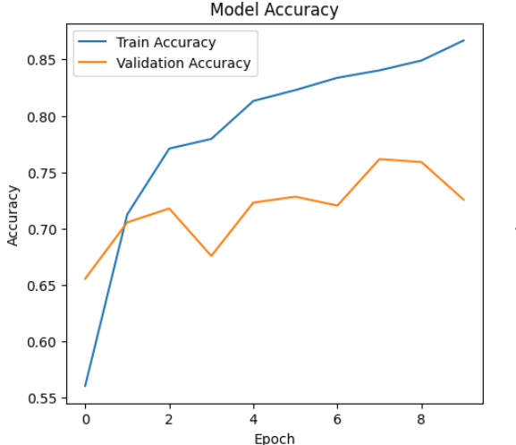
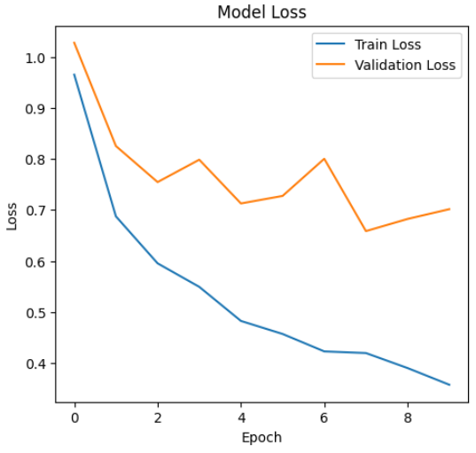
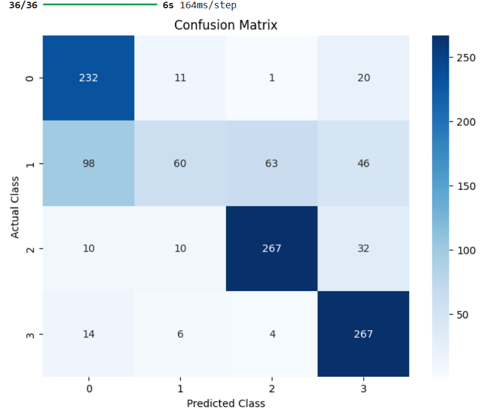
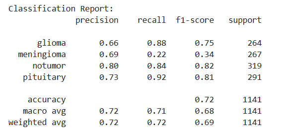

# Brain Tumor MRI Classification 🧠📊

Bu proje, **CNN (Convolutional Neural Networks)** kullanarak MRI görüntülerinden **beyin tümörü sınıflandırması** yapmayı amaçlamaktadır.  
Proje, supervised learning yaklaşımıyla hazırlanmıştır.

---

## 📂 İçerik

- `brain-tumor-mri.ipynb`: Eğitim ve değerlendirme için kullandığım notebook.

---

## 📊 Veri Seti

- Kullanılan veri seti: **Brain Tumor MRI Images**
- Kaynak: [Kaggle Dataset](https://www.kaggle.com/datasets/masoudnickparvar/brain-tumor-mri-dataset)

---

## 🚀 Kaggle Notebook

Projeyi Kaggle üzerinde çalıştırabilirsiniz:  
👉 [Kaggle Notebook Linki](https://www.kaggle.com/code/oguzhantan/brain-tumor-mri/edit)

---

## 🛠️ Kullanılan Teknolojiler

- Python 3.11  
- TensorFlow / Keras  
- NumPy, Matplotlib, Seaborn  
- scikit-learn  

---

## 📈 Sonuçlar

- **Model Doğruluğu (Accuracy):** `%72`  

📌 Eğitim sürecinde elde edilen grafikler:  

  
  
  
 

---

